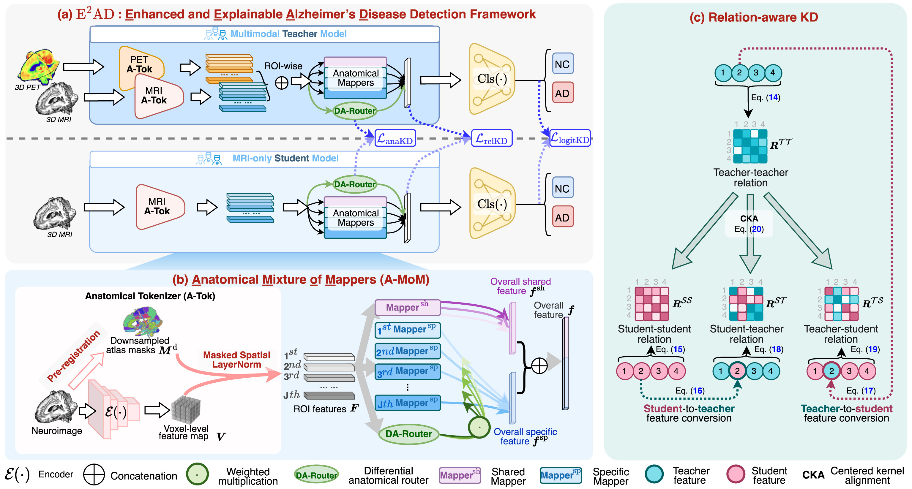

# E2AD: Enhanced and Explainable Alzheimer’s Disease Detection Framework

[](https://www.sciencedirect.com/science/article/pii/S1361841526001684) 

This is the official code implementation of **E<sup>2</sup>AD** proposed in the manuscript: "**E<sup>2</sup>AD: Enhanced and Explainable Alzheimer’s Disease Detection Framework via Anatomy- and Relation-aware Cross-modal Knowledge Distillation**".

## 📖 Overview

We introduce **E<sup>2</sup>AD**, an Enhanced and Explainable Alzheimer's disease detection framework that trains on paired MRI-PET data but requires **only MRI at inference**. To improve upon traditional knowledge distillation, E<sup>2</sup>AD transfers multimodal knowledge via:

* **Anatomy-aware Distillation:** Captures and transfers within-subject anatomical dependencies.
* **Relation-aware Distillation:** Aligns between-subject structural relations for better cross-cohort generalization.

Additionally, E<sup>2</sup>AD includes a tailored multi-agent workflow as an add-on to translate the model's anatomical attention into structured, clinician-oriented diagnostic reports.

<div align="center">
 
</div>

## 🚀 Requirements

The framework was tested on Linux with the following core environment:

- Python 3.8.0
- PyTorch 1.12.1 + CUDA 11.3
- torchvision 0.13.1 + CUDA 11.3
- NumPy 1.22.3

The code also requires pandas, scikit-learn, tqdm, Weights & Biases, MONAI, timm, and nibabel.

## 📁 Data Preparation

Extensive experiments in our paper were conducted using one internal cohort and two external cohorts. Please ensure your data is properly preprocessed and organized before training:

* **ADNI** (Alzheimer's Disease Neuroimaging Initiative)
* **NACC** (National Alzheimer's Coordinating Center)
* **AIBL** (Australian Imaging, Biomarker & Lifestyle Flagship Study of Ageing)

Preprocess MRI, PET, and atlas label maps into the following structure. Configure the dataset location in `utils/OurDataset.py` before training.
```text
DATA_ROOT/
├── all_mri_dict.pkl
├── pure_mri_dict.pkl
├── paired_dict.pkl
├── MRI/{NC,AD,SMCI,PMCI}/<subject_id>.nii.gz
├── Final_PET/{NC,AD,SMCI,PMCI}/<subject_id>.nii.gz
└── flirt_atlas/{NC,AD,SMCI,PMCI}/<subject_id>.nii.gz
```

Each pickle file maps integer fold IDs 0..4 to lists of (subject_id, label) records. Labels must be stored as strings: '0' for NC, '1' for AD, '3' for sMCI, and '4' for pMCI. 

### Input and Atlas Shapes
Please refer to our **[Unified 3D Cross-Modality Synthesis Codebase](https://github.com/thibault-wch/A-Unified-3D-Cross-Modality-Synthesis-Codebase)** for:  **[Multi-thread preprocessing](https://github.com/thibault-wch/A-Unified-3D-Cross-Modality-Synthesis-Codebase/tree/main/preprocess)** codes for 3D MRI and PET brain images. 

After MONAI preprocessing, MRI and PET tensors have shape (B, 1, 192, 224, 192). Atlas labels use 0 for background and 1..56 for anatomical regions. After one-hot encoding and removing the background channel, the atlas tensor has shape (B, 56, 24, 28, 24).
Here, B denotes batch size. All MRI, PET, and atlas volumes must be spatially aligned before loading.

## ⚙️ Training Pipeline

Run all commands from the repository root. Select the physical GPU with `CUDA_VISIBLE_DEVICES`; inside the process use logical GPU `0`.

**Step 1: Single-modal Pre-training (Optional)**
Train the baseline MRI model on all available MRI subjects. This step provides a solid initialization for the subsequent stages.

```bash
CUDA_VISIBLE_DEVICES=0  bash single_train.sh
```

**Step 2: Multi-modal Teacher Training**
Train the paired MRI-PET teacher model exclusively on subjects that have both MRI and PET scans available.

```bash
CUDA_VISIBLE_DEVICES=0 bash multi_train.sh
```

**Step 3: Cross-modal Knowledge Distillation**
Execute the core KD process to transfer rich anatomy- and relation-aware knowledge from the multi-modal teacher to the MRI-only student model.

```bash
CUDA_VISIBLE_DEVICES=0 bash distill_train.sh
```

> **📌 Inference Note:** Once the distillation training (Step 3) is complete, the resulting student model requires **only MRI** inputs for AD detection.

## 📝 Citation

If you find this code or our paper useful for your research, please star 🌟 this repository and cite our work:

```bibtex
@article{wang2026e2ad,
  title={E2AD: Enhanced and explainable {Alzheimer's} disease detection framework via anatomy-and relation-aware cross-modal knowledge distillation},
  author={Wang, Chenhui and Piao, Sirong and Chen, Zhihao and Chen, Tao and Li, Zhaoyang and Zhang, Tongrui and Li, Yuxin and Zhao, Xing-Ming and Shan, Hongming},
  journal={Medical Image Analysis},
  pages={104099},
  year={2026},
  publisher={Elsevier}
}

```
